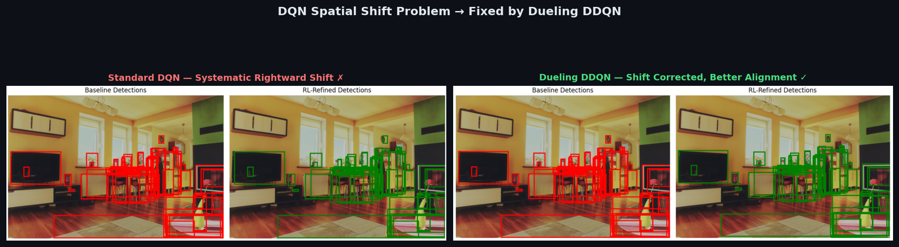
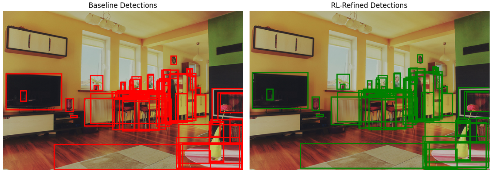

# Reinforcement Learning BBox Refine

Using **Dueling Double DQN (DDQN)** as a lightweight post-processing module to refine bounding box predictions from a Deformable-DETR object detector — and the full research journey that led there.

## Why DDQN? The Left-Shift Problem

Standard DQN introduces a **systematic spatial shift** in refined bounding boxes — the agent consistently pushes predictions rightward, degrading COCO metrics (mAP@[0.50:0.95] drops from 0.012 to 0.009). This is caused by DQN's overestimation bias: the max-Q selector and the evaluator are the same network, causing the agent to favor specific spatial directions over true IoU improvement.

**Dueling DDQN** decouples value estimation from action selection (separate target and online networks) and separates state-value V(s) from advantage A(s,a), eliminating the directional overestimation bias:



*Left: Standard DQN refined boxes exhibit systematic rightward shift — green boxes misaligned against the ground scene. Right: Dueling DDQN corrects the shift, producing tighter spatial alignment with significantly better structural coherence.*

## Before vs. After: BBox Refinement (DDQN)



*Raw Deformable-DETR detections (left) vs. Dueling DDQN-refined bounding boxes (right). The RL agent corrects systematic localization bias, tightening box alignment with ground truth.*

## The Research Journey

```
Phase 1: Pix2Seq + PPO       ──► FAILED  (divergence, action-space explosion: 2,094 tokens)
Phase 2: DINO + Reinforce    ──► FAILED  (AP 2.8 vs. expected 49.4 in 12 epochs)
Phase 3: CLIP + OneFormer    ──► Team pivot (human feedback direction)
Phase 4: Deformable-DETR
         + Dueling DDQN      ──► WORKING ✓  (converged, reduces localization bias)
```

The core insight that made Phase 4 succeed: **stop asking RL to generate everything from scratch**. Instead, use it as a **lightweight corrector** on top of an already-competent detector.

---

## DDQN Bounding Box Refinement

### Architecture

```
Input Image
    │
    ▼
Deformable-DETR Backbone  (frozen during RL training)
    │
    ▼
Candidate Bounding Boxes + Feature Embeddings
    │
    ▼
┌──────────────────────────────────────────────────┐
│         Dueling Double DQN Agent                 │
│                                                  │
│  State:  Normalized spatial features             │
│          + candidate box embeddings              │
│                                                  │
│  Actions (9 discrete):                           │
│   ← Move Left   → Move Right                    │
│   ↑ Move Up     ↓ Move Down                     │
│   ⊞ Expand      ⊟ Shrink                        │
│   ◱ Wider       ◳ Taller     ✓ Stop             │
│                                                  │
│  Reward:  ΔIoU (improvement in IoU with GT box) │
│           Positive if IoU improves, else 0       │
│                                                  │
│  Loss:    Huber loss + TD learning               │
│  Arch:    Dueling streams                        │
│           Value V(s) + Advantage A(s,a)          │
└──────────────────────────────────────────────────┘
    │
    ▼
Refined Bounding Boxes  →  Final Detection Output
```

### Why Dueling Architecture?

Standard DQN estimates Q(s,a) directly. Dueling DQN separates:
- **Value stream V(s)**: "how good is this state in general?"
- **Advantage stream A(s,a)**: "how much better is action *a* vs. average?"

This separation allows the agent to learn which states are valuable without needing to evaluate every action, accelerating convergence for the refinement task where most actions at a "good" box position have similar Q-values.

---

## Training Results

### Loss Convergence (Dueling DDQN)


### Q-Value Convergence


### Exploration Rate Decay


### Candidate Success Rate


### COCO Metrics: Baseline vs. Refined


---

## Phase 1 Failure Analysis: Why Pix2Seq+PPO Didn't Work

| Failure Mode | Root Cause |
|---|---|
| Actor/Critic divergence | PPO's KL constraint couldn't handle 2,094-token action space |
| Action space mismatch | NLP generates tokens one-by-one; Pix2Seq generates all boxes simultaneously |
| mAP regression | After initial training, performance degraded regardless of LR schedule |
| LoRA + PPO | Reduced parameters ~90% via LoRA — still diverged |

**Attempted fix:** Forced action space to 594 tokens → AP near-zero (over-constrained model couldn't learn meaningful policy).

---

## Tech Stack

| Component | Technology |
|---|---|
| Language | Python 3 |
| Framework | PyTorch |
| Base Detector | Deformable-DETR |
| RL Algorithm | Dueling Double DQN (DDQN) |
| Also Explored | Pix2Seq+PPO, REINFORCE, DINO, Grounding DINO, SAM, SegFormer, OneFormer, CLIP |
| Dataset | COCO 2017 (subset) |

## My Contributions

- Full DDQN implementation: 9-action discrete space design, IoU-delta reward, Huber+TD loss, dueling stream architecture
- Pix2Seq+PPO experiments: systematic action space reduction analysis
- Root-cause diagnosis of PPO divergence in multi-box visual generation tasks
- Architecture pivot decisions documented at each phase with experimental evidence
- COCO evaluation harness for AP comparison: baseline vs. RL-refined

## Repository Structure

```
RL_BBox_Refine/
├── README.md
├── CHANGELOG.md
├── gemini_project_analysis.txt        ← Full 3-phase research journey
├── DDQN/
│   ├── duelingdqn.ipynb               ← Main DDQN notebook
│   ├── OD_with_RL_report.pdf          ← Project report
│   ├── baseline_refine_bbox_comparison_dueling.png  ← Before/After
│   ├── COCO_metrics_comparison_dueling.png
│   ├── training_Loss_curve_dueling.png
│   ├── average_qvalue_convergence_dueling.png
│   ├── exploration_rate_over_time_dueling.png
│   ├── candidate_success_rate_dueling.png
│   └── DQNarchitecture.png / diagram.png
└── Pix2siq_PPO/
    ├── ppo.py                          ← PPO training (historical experiments)
    └── reward.py
```

---

*Research Project · Python · PyTorch · Reinforcement Learning · Vision Transformers · COCO 2017*
