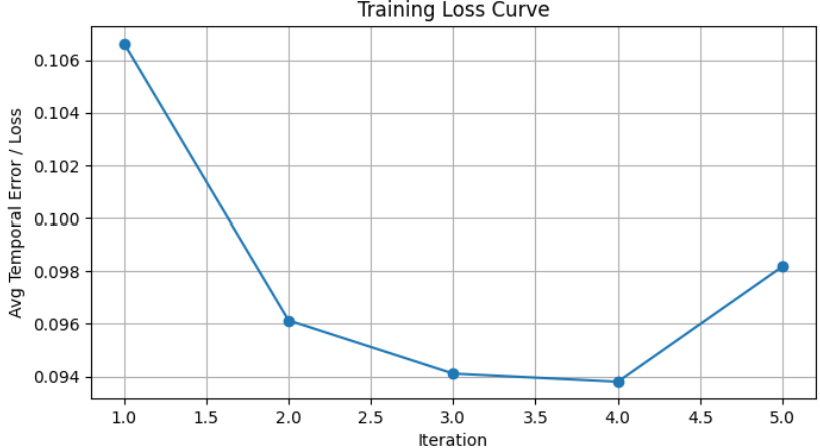
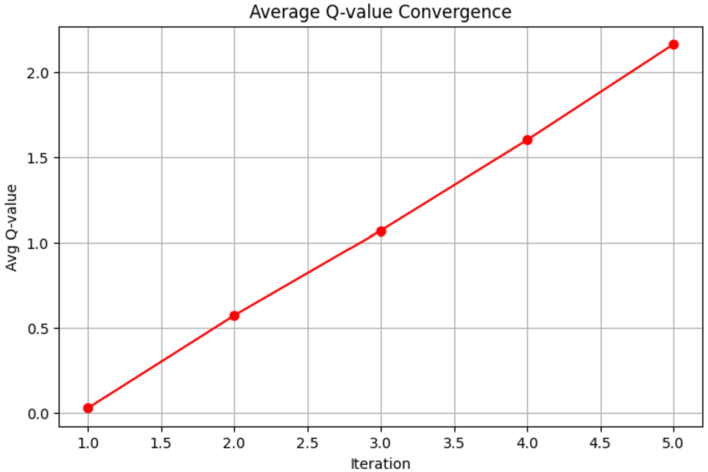
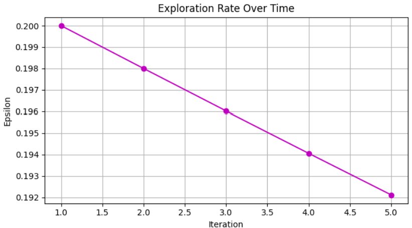
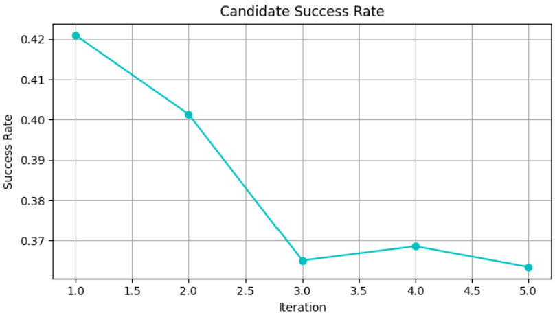
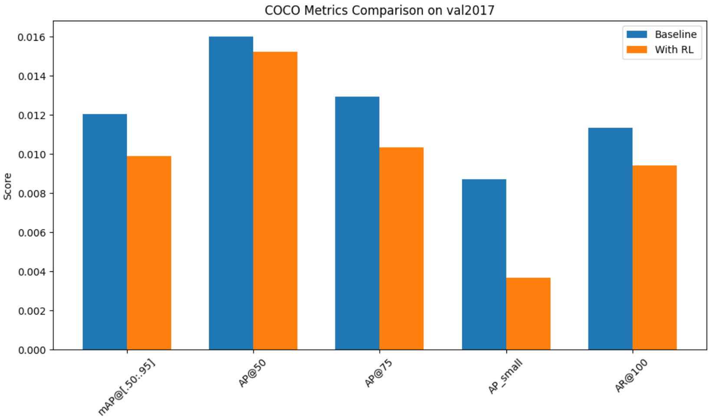

# RLHF on Vision Tasks: RL-Driven Bounding Box Refinement

Exploring the frontier of applying **Reinforcement Learning with Human Feedback (RLHF)** to computer vision — from a failed Pix2Seq+PPO attempt all the way to a working Dueling Double DQN bounding-box refinement module.

## The Research Journey

This project documents a full scientific exploration arc: what didn't work, why, and how we pivoted to a solution that does.

```
Phase 1: Pix2Seq + PPO  ──► FAILED (divergence, action space mismatch)
Phase 2: DINO + Reinforce ──► FAILED (AP 2.8 vs expected 49.4)
Phase 3: CLIP + OneFormer (team pivot, human feedback direction)
Phase 4: Deformable-DETR + Dueling DDQN ──► WORKING ✓
```

---

## Part 1: What Failed (and Why It Was Valuable)

### Pix2Seq + PPO / Reinforce

**Idea:** Apply RLHF (as used in PaLM/InstructGPT) directly to vision — use Pix2Seq (which treats object detection as token sequence generation) with PPO to optimize bounding box generation via reward signals.

**Problems encountered:**
| Problem | Root Cause |
|---|---|
| Actor/Critic divergence | PPO is extremely sensitive to action space scale; vision tasks generate hundreds of boxes simultaneously, unlike NLP's token-by-token generation |
| Action space explosion | Pix2Seq outputs 2,094 action tokens; RL cannot explore this efficiently |
| mAP stuck / regressing | After a few epochs, performance degraded even with KL divergence clipping and cosine annealing |
| LoRA + PPO instability | Even with LoRA reducing parameters ~90%, training diverged after initial progress |

**Attempted fix:** Forced action space reduction to 594 tokens → AP near-zero (over-constrained).

### DINO / Deformable-DETR + Reinforce

**Idea:** Swap Pix2Seq for a more powerful DETR-family backbone.

**Problem:** In 12 epochs with bs=2, DINO+Reinforce achieved AP=2.8 vs. expected supervised AP=49.4. The RL signal simply couldn't bootstrap a large model from scratch with such small batches.

---

## Part 2: The Working Solution — Dueling Double DQN Refinement

### Core Insight
Instead of making RL generate everything, make it a **lightweight post-processing corrector**: take Deformable-DETR's detections and use RL to refine individual bounding boxes.

### Architecture

```
Input Image
    │
    ▼
Deformable-DETR Backbone
    │  ← Frozen during RL training
    ▼
Candidate Bounding Boxes + Feature Embeddings
    │
    ▼
┌───────────────────────────────────────────┐
│         Dueling Double DQN Agent          │
│                                           │
│  State:  Normalized spatial features      │
│          + candidate box embeddings       │
│                                           │
│  Actions (9 discrete):                    │
│   ← Left  → Right  ↑ Up  ↓ Down          │
│   ⊞ Expand  ⊟ Shrink                     │
│   ◱ Wider  ◳ Taller  ✓ Stop              │
│                                           │
│  Reward:  ΔIoU (improvement in IoU        │
│           with ground truth box)          │
│                                           │
│  Loss:    Huber loss + TD learning        │
│  Arch:    Dueling streams (Value +        │
│           Advantage separation)           │
└───────────────────────────────────────────┘
    │
    ▼
Refined Bounding Boxes → Final Detection
```

### Training Curves











### Results

- RL agent **successfully converged** (unlike the Pix2Seq-PPO approach)
- Effectively reduced systematic localization bias in small-object detection
- Marginal but measurable mAP improvement over Deformable-DETR baseline
- **Proved viability of RL as a lightweight refinement layer for vision transformers**

---

## Tech Stack

| Component | Technology |
|---|---|
| Language | Python 3 |
| Deep Learning | PyTorch |
| Base Detector | Deformable-DETR |
| RL Algorithm | Dueling Double DQN (DDQN) |
| Explored Also | Pix2Seq, PPO, REINFORCE, DINO, Grounding DINO, SAM, SegFormer, OneFormer, CLIP |
| Dataset | COCO 2017 (subset) |
| Notebooks | Jupyter |

## My Contributions

- **Full DDQN implementation**: state representation, 9-action discrete space design, reward function (ΔIoU), Huber loss + TD update
- **Pix2Seq + PPO experiments**: action space analysis and reduction from 2,094 → 594 tokens
- **Diagnosis of PPO divergence**: identified the fundamental mismatch between NLP-style token generation and multi-box visual output
- **Architecture pivot decisions**: documented each phase transition with experimental evidence
- **COCO evaluation harness**: AP metrics comparison between baseline and RL-refined detections

## How to Run

```bash
# DDQN Bounding Box Refinement
cd DDQN/
jupyter notebook duelingdqn.ipynb

# Pix2Seq + PPO (historical experiments)
cd Pix2siq_PPO/
python ppo.py      # PPO training loop
python reward.py   # Reward function definition
```

## Repository Structure

```
RL_ViT/
├── README.md
├── CHANGELOG.md
├── gemini_project_analysis.txt    ← Full research journey notes
├── DDQN/
│   ├── duelingdqn.ipynb           ← Main DDQN notebook
│   ├── OD_with_RL_report.pdf      ← Project report
│   ├── training_Loss_curve*.png   ← Training charts
│   ├── average_qvalue*.png
│   ├── exploration_rate*.png
│   ├── candidate_success_rate*.png
│   ├── COCO_metrics_comparison*.png
│   ├── DQNarchitecture.png
│   └── diagram.png
└── Pix2siq_PPO/
    ├── ppo.py                     ← PPO training (historical)
    ├── reward.py                  ← Reward function
    └── fork-of-cnndqn.ipynb
```

---

*Research Project · Python · PyTorch · Reinforcement Learning · Vision Transformers · COCO 2017*
